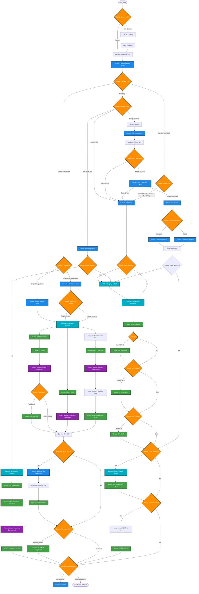

# FQS Account Launcher — Flow Diagram

```mermaid
flowchart TD
    %% Node Styles
    classDef hub fill:#2A3B50,stroke:#333,stroke-width:2px,color:#fff;
    classDef screen fill:#1E88E5,stroke:#333,stroke-width:2px,color:#fff;
    classDef decision fill:#FF8F00,stroke:#333,stroke-width:2px,color:#fff;
    classDef create fill:#43A047,stroke:#333,stroke-width:2px,color:#fff;
    classDef action fill:#8E24AA,stroke:#333,stroke-width:2px,color:#fff;
    classDef subflow fill:#00ACC1,stroke:#333,stroke-width:2px,color:#fff;

    %% ENTRY & CENTRAL HUB
    ENTRY([Flow Start]) --> DecEntry{Decide: Entry Mode?}
    DecEntry -- GC Context --> GetGCContext[Get GC Context] --> PrepPP[Prep Schedule]
    DecEntry -- Standard --> GetAcct[Get Account & Contacts] --> ScreenCat[Screen: Category & Leaf Picker]

    ScreenCat --> DecCat{Decide: Category Line}

    %% RED LINE: MONETARY LINE
    DecCat -- Monetary --> DecMonetary{Decide: Monetary Leaf}

    %% Outright Branch
    DecMonetary -- Outright Gift --> ScreenSingle[Screen: Gift Details]
    ScreenSingle --> DecMatch{Decide: Match Wanted?}
    DecMatch -- Yes --> SubMatch[Subflow: Employer Match] --> SubResolver
    DecMatch -- No --> SubResolver[Subflow: Designation Resolver]
    SubResolver --> CreateGT[Create: Gift Transaction] --> DecInKindSelf{In-Kind?}

    %% Pledge Payment Branch
    DecMonetary -- Pledge Payment --> GetGCActive[Get Active GCs] --> ScreenPickGC[Screen: Pick Commitment]
    ScreenPickGC --> GetGCS[Get GCS & Open GTs] --> DecOpenGT{Decide: Has Open GTs?}
    DecOpenGT -- Open GTs Exist --> ScreenPPMode[Screen: Post Existing vs New]
    DecOpenGT -- No Open GTs --> ScreenSingle
    ScreenPPMode -- Update Scheduled --> ScreenSinglePP[Screen: Gift Details] --> DecMismatch{Decide: Amount Mismatch?}
    DecMismatch -- Mismatch --> WarnMismatch[Screen: Mismatch Warning] --> UpdateGT[Update: Existing GT]
    DecMismatch -- Match --> ConfirmPP[Screen: Confirm PP Update] --> UpdateGT
    ScreenPPMode -- Record New --> ScreenSingle

    %% Recurring Branch
    DecMonetary -- Recurring Gift --> ScreenRec[Screen: Recurring Details]
    ScreenRec --> DecMatchRec{Decide: Match Eligible?}
    DecMatchRec -- Yes --> SubMatch
    DecMatchRec -- No --> SubResolverRec[Subflow: Designation Resolver]
    SubResolverRec --> CreateGCRec[Create: Gift Commitment]
    CreateGCRec --> CreateGCSRec[Create: Gift Commitment Schedule]
    CreateGCSRec --> ActRec[Action: Activate Recurring Commitment]
    ActRec --> CreateGTRecFirst[Create: First Payment GT] --> DecShowSuccess

    %% BLUE LINE: FUTURE COMMITMENTS LINE
    DecCat -- Future Commitment --> DecFuture{Decide: Future Leaf}

    %% Simple Pledge
    DecFuture -- Simple Pledge/Grant --> ScreenSimple[Screen: Simple Pledge Details]
    ScreenSimple --> SubResolverFuture[Subflow: Designation Resolver]
    SubResolverFuture --> CreateGCPledge[Create: Gift Commitment]
    CreateGCPledge --> CreateGCSSimple[Create: GCS N=1]
    CreateGCSSimple --> ActSimple[Action: Activate Simple Commitment]
    ActSimple --> DecSimplePast{Decide: Past-Dated?}
    DecSimplePast -- Past-Dated --> CreateGTSimplePast[Create: Past-Date GT] --> GetGTPastDue[Get Past-Due GTs]
    DecSimplePast -- Future-Dated --> GetGTPastDue

    %% Scheduled Pledge
    DecFuture -- Scheduled Pledge/Grant --> ScreenSched[Screen: Scheduled Details]
    ScreenSched --> DecSchedType{Decide: Regular or Custom?}
    DecSchedType -- Regular Equal --> SubResolverFuture
    SubResolverFuture --> CreateGCSched[Create: Parent GCS]
    CreateGCSched --> ActSched[Action: Activate Scheduled Commitment]
    ActSched --> GetGTPastDue

    DecSchedType -- Custom Unequal --> SubResolverFuture
    SubResolverFuture --> LoopRepeater[Loop: Custom Repeater Rows]
    LoopRepeater --> CreateGCSCustom[Create: GCS Collection]
    CreateGCSCustom --> ActCustom[Action: Activate Custom Commitment]
    ActCustom --> LoopCustomGT[Loop: Custom Past-Date Build]
    LoopCustomGT --> CreateGTCustomPast[Create: Custom Past-Date GTs] --> GetGTPastDue

    %% GREEN LINE: SPECIAL TRANSACTIONS LINE
    DecCat -- Special / Non-Cash --> DecSpecial{Decide: Special Leaf}
    DecSpecial -- In-Kind / Earned Income / Event Reg --> ScreenSingle

    %% POST-TRANSACTION / RECONCILIATION JUNCTION
    GetGTPastDue --> DecPastDue{Decide: Any Past-Due GTs?}
    DecPastDue -- Yes --> ScreenConfirmPast[Screen: Confirm Past Payments]
    ScreenConfirmPast --> LoopConfirmPaid[Loop: Mark Selected Paid] --> UpdateGTPaid[Update: Confirmed GTs] --> DecReconcileGDD
    DecPastDue -- No --> DecReconcileGDD{Decide: Reconcile GDD?}

    DecReconcileGDD -- Update Needed --> UpdateGDD[Update: Gift Default Designation] --> DecShowSuccess
    DecReconcileGDD -- No Update --> DecShowSuccess

    %% TERMINAL CHAIN
    DecInKindSelf -- Yes FMV > 0 --> CreateGSCInKind[Create: Self Soft Credit] --> DecGTD{Decide: GTD Create?}
    DecInKindSelf -- No --> DecGTD
    DecGTD -- Create GTD --> CreateGTD[Create: GT Designation] --> DecGSCCreate{Decide: GSC Create?}
    DecGTD -- Skip --> DecGSCCreate
    DecGSCCreate -- Create GSC --> CreateGSC[Create: Soft Credit] --> DecGDSC{Decide: GDSC Needed?}
    DecGSCCreate -- Skip --> DecGDSC
    DecGDSC -- Yes --> SubGDSC[Subflow / Screen: Reach GDSC] --> CreateGDSC[Create: Gift Default Soft Credit] --> DecGDSCFanout{Decide: Fanout to GSC?}
    DecGDSC -- No --> DecGDSCFanout
    DecGDSCFanout -- Yes --> LoopGDSC[Loop: Fanout GDSC to GSC] --> CreateGSCsGDSC[Create: GSC Collection] --> DecShowSuccess
    DecGDSCFanout -- No --> DecShowSuccess{Decide: Show Success?}

    DecShowSuccess -- Standard Entry --> ScreenSuccess[Screen: Success]
    DecShowSuccess -- Subflow Launcher --> Terminate([End / Return to Parent])

    %% Node Class Assignments
    class ScreenCat,ScreenSingle,ScreenPickGC,ScreenPPMode,ScreenSinglePP,WarnMismatch,ConfirmPP,ScreenRec,ScreenSimple,ScreenSched,ScreenConfirmPast,ScreenSuccess screen;
    class DecEntry,DecCat,DecMonetary,DecMatch,DecOpenGT,DecMismatch,DecMatchRec,DecFuture,DecSimplePast,DecSchedType,DecSpecial,DecPastDue,DecReconcileGDD,DecInKindSelf,DecGTD,DecGSCCreate,DecGDSC,DecGDSCFanout,DecShowSuccess decision;
    class CreateGT,CreateGCRec,CreateGCSRec,CreateGTRecFirst,CreateGCPledge,CreateGCSSimple,CreateGTSimplePast,CreateGCSched,CreateGCSCustom,CreateGTCustomPast,UpdateGTPaid,UpdateGDD,CreateGSCInKind,CreateGTD,CreateGSC,CreateGDSC,CreateGSCsGDSC create;
    class ActRec,ActSimple,ActSched,ActCustom action;
    class SubMatch,SubResolver,SubResolverRec,SubResolverFuture,SubGDSC subflow;

    %% 1. Connect Prep Schedule into the main pipeline at Get Account:
    PrepPP[Prep Schedule] --> GetAcct[Get Account & Contacts]

    %% 2. Connect Update GT to the match decision / success chain:
    UpdateGT[Update: Existing GT] --> DecMatchUpdate{Decide: Match Opted In?}
    DecMatchUpdate -- Yes --> SubMatch
    DecMatchUpdate -- No --> DecGDSC{Decide: GDSC Needed?}
```
