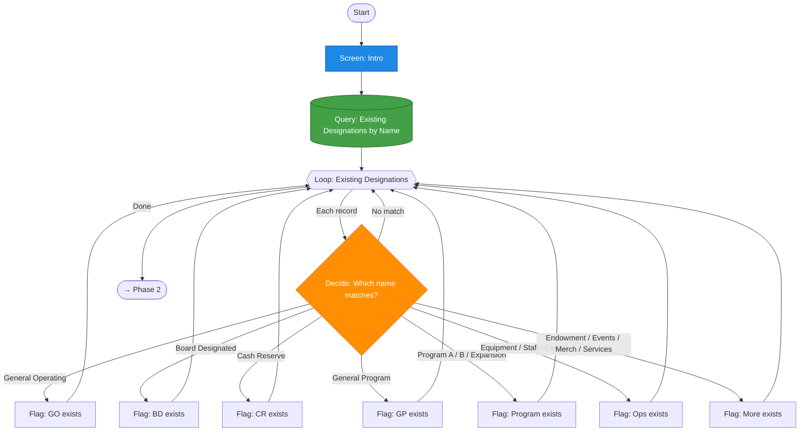
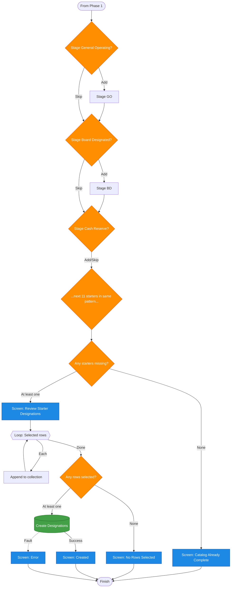
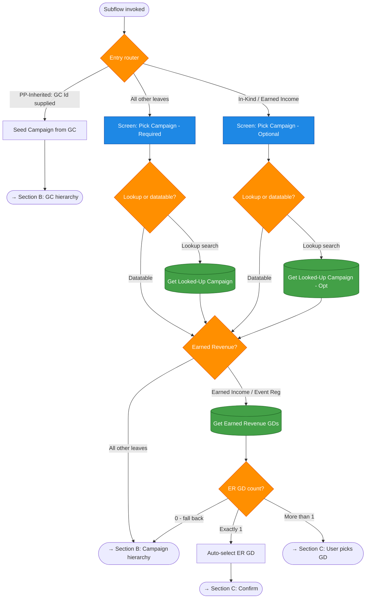
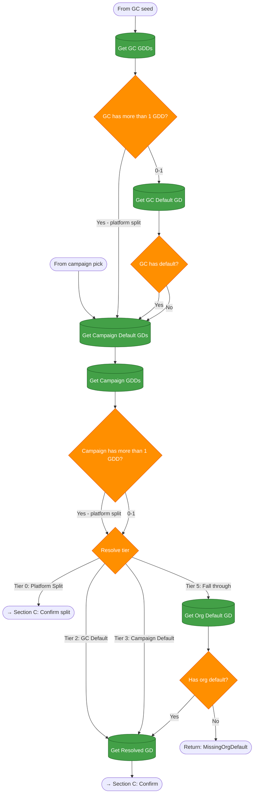
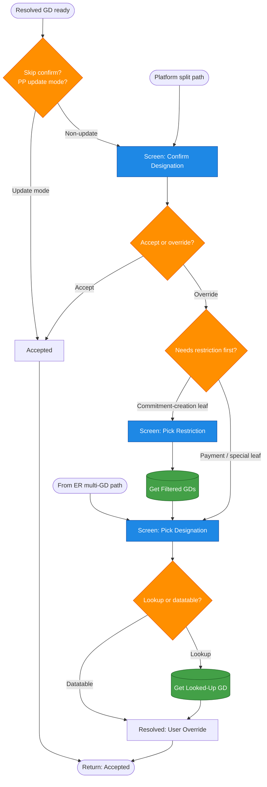

```mermaid
flowchart TD
    START([Start: Quick Action on Campaign])

    subgraph EntryPreProcessing["Entry & Pre-Processing (Learn Screens)"]
        S_Learn0[Step 0: Learn About Campaigns]
        S_LearnHier[Step 0: Learn Campaign Hierarchy]
        S_LearnChoices[Step 0: Learn Hierarchy Choices - IntroGate radio]
        D_Ready{Ready_to_Choose?<br/>IntroGate = Yes}
        END_Exit([Exit - user picks 'No, think further'])
    end

    subgraph MainRouting["Main Routing - Wizard Steps"]
        S_Model[Step 1: Choose Model<br/>Seasonal / Giving Programs / Audience]
        S_Year[Step 2: Choose Year Cohorts - multi-select]
        S_Strategies[Step 3: Pick Strategic + Operational]
        S_Asks[Step 4: Pick Tactical]
        S_Confirm[Step 5: Confirm & Build]
    end

    subgraph TemplateLoads["Template Lookups from FQS_Campaign_Template mdt"]
        L_Rollup[(Get_Rollup_Templates)]
        L_Strategy[(Get_Strategy_Templates)]
        L_Ask[(Get_Ask_Templates)]
        L_DefRollup[(Get_Default_Rollup_Templates)]
        L_DefStrategy[(Get_Default_Strategy_Templates)]
        L_DefAsk[(Get_Default_Ask_Templates - parent-filtered)]
        PROC_DefaultSeed[Seed default key strings<br/>Loop_Default_Rollups / Strategies / Asks]
    end

    subgraph MembershipLoops["Membership Loops - build selected-key collections"]
        A_ClearParents[Reset Strategic + Operational selection state]
        PROC_RollupMembers[Loop_Rollup_Membership<br/>Add checked keys to varSelectedRollupKeys]
        PROC_StrategyMembers[Loop_Strategy_Membership<br/>Add checked keys to varSelectedStrategyKeys]
        A_MergeParents[Merge parent keys for Tactical filter]
        A_ClearAsks[Reset Tactical selection state]
        PROC_AskMembers[Loop_Ask_Membership<br/>Add checked keys to varSelectedAskKeys]
    end

    subgraph YearRouting["Year Offset Routing - build varYearOffsets"]
        A_ResetAcc[Reset Build Accumulators]
        D_YearLast{Decide_Year_Last<br/>msYears contains LAST?}
        A_YearLast[Add -1 offset]
        D_YearThis{Decide_Year_This<br/>msYears contains THIS?}
        A_YearThis[Add 0 offset]
        D_YearNext{Decide_Year_Next<br/>msYears contains NEXT?}
        A_YearNext[Add +1 offset]
    end

    subgraph BuildLoop["Build Loop - one Apex call per selected year"]
        LOOP_Years[Loop_Year_Builds - iterate varYearOffsets]
        AC_Build[Build_Hierarchy Apex: FQS_CampaignHierarchyBuilder]
        A_Accumulate[Accumulate build outputs]
        D_LoopOrFinish{Decide_Loop_Or_Finish<br/>varErrorMessage set?}
        D_BuildError{Decide_Build_Error<br/>any error returned?}
    end

    subgraph PostProcessing["Post-Processing & Terminal States"]
        S_Success[Review + Edit Datatable - rcv_CampaignsCreated]
        S_Final[Campaign Hierarchy - Done]
        S_Error[Campaign Hierarchy - Error]
        END_Done([Flow ends])
    end

    START --> S_Learn0
    S_Learn0 --> S_LearnHier
    S_LearnHier --> S_LearnChoices
    S_LearnChoices --> D_Ready
    D_Ready -->|Yes - Proceed| S_Model
    D_Ready -->|Not yet - default| END_Exit

    S_Model --> S_Year
    S_Year --> L_Rollup
    L_Rollup --> L_Strategy
    L_Strategy --> L_Ask
    L_Ask --> L_DefRollup
    L_DefRollup --> PROC_DefaultSeed
    PROC_DefaultSeed --> L_DefStrategy
    L_DefStrategy --> S_Strategies

    S_Strategies --> A_ClearParents
    A_ClearParents --> PROC_RollupMembers
    PROC_RollupMembers --> PROC_StrategyMembers
    PROC_StrategyMembers --> A_MergeParents
    A_MergeParents --> L_DefAsk
    L_DefAsk --> S_Asks

    S_Asks --> A_ClearAsks
    A_ClearAsks --> PROC_AskMembers
    PROC_AskMembers --> A_ResetAcc

    A_ResetAcc --> D_YearLast
    D_YearLast -->|Yes - Add -1| A_YearLast
    D_YearLast -->|No - Skip| D_YearThis
    A_YearLast --> D_YearThis
    D_YearThis -->|Yes - Add 0| A_YearThis
    D_YearThis -->|No - Skip| D_YearNext
    A_YearThis --> D_YearNext
    D_YearNext -->|Yes - Add +1| A_YearNext
    D_YearNext -->|No - Skip| S_Confirm
    A_YearNext --> S_Confirm

    S_Confirm --> LOOP_Years
    LOOP_Years -->|Next offset| AC_Build
    AC_Build -->|Success| A_Accumulate
    AC_Build -.->|Fault| S_Error
    A_Accumulate --> D_LoopOrFinish
    D_LoopOrFinish -->|No - Continue| LOOP_Years
    D_LoopOrFinish -->|Yes - Break on error| D_BuildError
    LOOP_Years -->|No more values| D_BuildError

    D_BuildError -->|Yes - Error| S_Error
    D_BuildError -->|No - No error| S_Success
    S_Success --> S_Final
    S_Final --> END_Done
    S_Error -.->|Retry - GoTo| S_Model

    classDef screen fill:#1E88E5,color:#FFF,stroke:#0D47A1
    classDef decision fill:#FF8F00,color:#FFF,stroke:#E65100
    classDef dml fill:#43A047,color:#FFF,stroke:#1B5E20
    classDef action fill:#8E24AA,color:#FFF,stroke:#4A148C

    class S_Learn0,S_LearnHier,S_LearnChoices,S_Model,S_Year,S_Strategies,S_Asks,S_Confirm,S_Success,S_Final,S_Error screen
    class D_Ready,D_YearLast,D_YearThis,D_YearNext,D_LoopOrFinish,D_BuildError decision
    class L_Rollup,L_Strategy,L_Ask,L_DefRollup,L_DefStrategy,L_DefAsk dml
    class AC_Build action
```

# FQS Flow Descriptions

*Companion to [Metadata Inventory](fqs-metadata-inventory.md). Every FQS flow that ships in the unmanaged package, with an admin-facing summary and a collapsible developer-detail block per flow. Six flows above the 5-decision threshold also carry a Mermaid architecture diagram — junior-admin-friendly, node-classified per the diagram spec in `.planning/prompts/flow-to-mermaid-diagram.md`.*

---

## How to read this doc

Each entry has two parts:

- **Admin summary** — plain-English "what it does / when it fires / how to turn it off". Written for the admin who needs to decide whether to keep the flow enabled or diagnose a broken automation.
- **Developer detail** (`
` block, collapsed by default) — trigger type, entry filter, subflow call graph, key gotchas encountered during authoring, cross-links to `docs/dev/` deep-dives and to the auto-memory record (`[[<slug>]]`) for tricky patterns.

The six high-complexity flows (Guided Gift Entry Account, Suggest Designations, GGE Campaign Designation Resolver, both CampaignMember Status trigger flows, Campaign Hierarchy Setup) also include a **Mermaid architecture diagram** below the admin summary — same color legend as the [flow-to-mermaid spec](../.planning/prompts/flow-to-mermaid-diagram.md): blue = Screen, amber = Decision, green = DML, purple = Action Call, cyan = Subflow.

**Global disable switch** — every record-triggered FQS flow gates on `$Permission.FQS_Bypass_Automation`. Assign the **FQS Bypass Automation** permission set to any user (data migration, integration user, Data Loader) whose transactions should skip FQS automation; run `scripts/apex/fqs-recalc-gc-fulfillmenttype.apex` (or the equivalent recalc script) afterward to reconcile. See [[fqs-bypass-automation-pattern]].

---

## Table of contents

**Screen flows (launcher / setup / guide)**

1. [FQS Guided Gift Entry — Account (monolith)](#fqs-guided-gift-entry--account-monolith)
2. [FQS Guided Gift Entry — Home Page](#fqs-guided-gift-entry--home-page)
3. [FQS Guided Gift Entry — Opportunity](#fqs-guided-gift-entry--opportunity)
4. [FQS Guided Gift Entry — Gift Commitment](#fqs-guided-gift-entry--gift-commitment)
5. [FQS Refund Gift](#fqs-refund-gift)
6. [FQS Refund Gift From Donor](#fqs-refund-gift-from-donor)
7. [FQS Create Gift Batch](#fqs-create-gift-batch)
8. [FQS Suggest Designations](#fqs-suggest-designations)
9. [FQS Campaign Hierarchy Setup](#fqs-campaign-hierarchy-setup)
10. [FQS Setup Tier Thresholds](#fqs-setup-tier-thresholds)
11. [FQS Setup Stewardship Response Settings](#fqs-setup-stewardship-response-settings)
12. [FQS Acknowledgement, Stewardship & Tax Guide](#fqs-acknowledgement-stewardship--tax-guide)

**Subflows**
13. [FQS Guided Gift Entry Subflow — Campaign / Designation Resolver](#fqs-guided-gift-entry-subflow--campaign--designation-resolver)
14. [FQS Guided Gift Entry Subflow — Employer Match](#fqs-guided-gift-entry-subflow--employer-match)
15. [FQS Guided Gift Entry Subflow — Soft Credit Reach](#fqs-guided-gift-entry-subflow--soft-credit-reach)
16. [FQS Recalculate GC FulfillmentType](#fqs-recalculate-gc-fulfillmenttype)

**Record-triggered (BeforeSave)**
17. [FQS Auto Category Gift Transaction](#fqs-auto-category-gift-transaction)
18–20. [FQS Auto Name flows](#fqs-auto-name-flows) (Gift Commitment, Gift Transaction, Opportunity)

**Record-triggered (AfterSave)**
21. [FQS Campaign Auto Members Default](#fqs-campaign-auto-members-default)
22. [FQS Campaign Child Count Update](#fqs-campaign-child-count-update)
23. [FQS Campaign Create First OSC](#fqs-campaign-create-first-osc)
24. [FQS Campaign Member Status Ladder](#fqs-campaign-member-status-ladder)
25. [FQS Campaign Member Status On Commitment](#fqs-campaign-member-status-on-commitment)
26. [FQS Campaign Member Status On Gift Transaction](#fqs-campaign-member-status-on-gift-transaction)
27. [FQS GC Fulfillment From GDD](#fqs-gc-fulfillment-from-gdd)
28. [FQS GC Fulfillment On Change](#fqs-gc-fulfillment-on-change)

**Record-triggered (BeforeDelete)**
29. [FQS Campaign Child Count Delete](#fqs-campaign-child-count-delete)
30. [FQS Campaign Member Status On Commitment Delete](#fqs-campaign-member-status-on-commitment-delete)
31. [FQS Campaign Member Status On Gift Transaction Delete](#fqs-campaign-member-status-on-gift-transaction-delete)
32. [FQS GC Fulfillment From GDD Delete](#fqs-gc-fulfillment-from-gdd-delete)

**Scheduled / autolaunched**
33. [FQS Automatic Rollup Updates](#fqs-automatic-rollup-updates)
34. [FQS Coordinate Gift Commitment Processing](#fqs-coordinate-gift-commitment-processing)
35. [FQS Gift Acknowledgement](#fqs-gift-acknowledgement)
36. [FQS Stewardship Response](#fqs-stewardship-response)

---

## Screen flows (launcher / setup / guide)

### FQS Guided Gift Entry — Account (monolith)

**Admin summary**: The universal Guided Gift Entry engine. Every other GGE launcher (Home Page, Opportunity, Gift Commitment) is a thin wrapper that hands off to this flow. Presents a category picker (Outright / Recurring / Pledged / Grant / In-Kind / Earned Income / Event Registration), collects donor + campaign + designation + amount + schedule per the picked shape, and creates the Gift Commitment plus any needed GCSs, GTs, GDDs, GDs, and soft-credit / employer-match sidecar records. Fires from the **FQS Guided Gift Entry** quick action on Account.
_When_: user-triggered.
_Disable via_: remove the quick action from the Account page layout / flexipage.

**Diagram**:

```mermaid
flowchart TD

    subgraph Entry["Entry & Context Loading"]
        START([Quick Action: Account or subflow caller])
        Get_Acct[(Get Donor Account)]
        Decide_Entry{Decide_Screen_Entry_Mode<br/>GC-context vs new gift}
        Decide_Skip_Cat{Decide_Screen_Skip_Category<br/>preselect supplied?}
        Decide_Preselect{Decide_Preselect_Route<br/>leaf preselect value}
        Get_GC_Context[(Get GC + child GCSs)]
        Sub_SCR[Subflow: Soft Credit Reach<br/>ACR household reach]
    end

    subgraph CategorySelection["Category & Leaf Selection"]
        S_Category[Screen: Intro_ChooseCategoryAndLeaf<br/>Outright / Recurring / Pledge /<br/>Grant / In-Kind / Earned Income / Event]
        Decide_Monetary{Decide_Screen_Leaf_Monetary<br/>Outright / Event?}
        Decide_Future{Decide_Screen_Leaf_Future<br/>Pledge / Grant shape?}
        Decide_Special{Decide_Screen_Leaf_Special<br/>In-Kind / Earned Income?}
    end

    subgraph NewGiftPaths["New Gift — Detail Screens"]
        S_Single[Screen: Details_SinglePayment<br/>amount + date]
        S_Recurring[Screen: Details_Recurring<br/>amount + frequency + start]
        S_Pledge[Screen: Details_Pledge<br/>total + term + instalments]
        S_Scheduled[Screen: Details_Scheduled<br/>amount + schedule + end]
    end

    subgraph ExistingPath["Add to Existing Commitment"]
        Decide_HasGC{Decide_GC_Has_Commitment<br/>contextCommitmentId set?}
        Decide_GCPicker{Decide_GC_Show_Picker<br/>show commitment picker?}
        S_PickCommitment[Screen: Pick_Commitment]
        S_PickCampaignFromGC[Screen: Pick_CampaignFromCommitment]
        S_ConfirmPledgeUpdate[Screen: Confirm_PledgePaymentUpdate]
        S_ConfirmExistingScheduled[Screen: Confirm_UseExistingScheduledPayment]
        Decide_ExistingGT{Decide_GT_Has_Existing_Open<br/>open expected GT found?}
        S_ConfirmPastPayments[Screen: Confirm_PastPayments]
    end

    subgraph CampaignDesig["Campaign & Designation Resolution"]
        Sub_Resolver[Subflow: Campaign_Designation_Resolver<br/>returns campaignId + designationId]
        Decide_ResolverError{Decide_Resolver_DidError?}
        Decide_ResolverReturn{Decide_Resolver_Return_Router<br/>Accepted / MissingOrgDefault}
        Err_MissingDesig[Screen: Error_MissingDefaultDesignation]
        Err_Load[Screen: Error_CouldNotLoadData]
    end

    subgraph SoftCreditMatch["Soft Credit, Match & GDD Side-Cars"]
        S_SoftCredit[Screen: Pick_SoftCredit]
        S_SoftCreditForGC[Screen: Pick_SoftCreditForCommitment]
        S_SoftCreditAmt[Screen: Details_SoftCreditAmount]
        Decide_GSCWant{Decide_GSC_User_Wants?}
        Decide_GSCBuild{Decide_GSC_Build}
        Decide_MatchNeeded{Decide_Match_Needed /<br/>Decide_Match_Needed_Recurring}
        Sub_MatchResolve[Subflow: Match_Resolve]
        Sub_MatchCreate[Subflow: Match_CreateAndPair]
        Warn_AmtMismatch[Screen: Warning_AmountMismatch]
    end

    subgraph RecordCreation["Record Creation"]
        Create_GC[(Create_GC_Pledge)]
        Create_GCS[(Create_GCS_Simple /<br/>Recurring / Scheduled / Custom)]
        Process_GC[Action: processGiftCommitment<br/>activate schedule + fan out GTs]
        Create_GT[(Create_GT /<br/>GT_SimplePastDate / GT_CustomPastDate /<br/>GT_RecurringFirstPayment)]
        Create_GDD[(Create_GDD<br/>GiftDefaultDesignation)]
        Create_GDSC[(Create_GDSC<br/>GiftDesignationSoftCredit)]
        Create_GTD[(Create_GTD /<br/>GTD_Split<br/>GiftTransactionDesignation)]
        Create_GSC[(Create_GSC /<br/>GSC_InKindSelf / GSC_FromGDSCs)]
    end

    subgraph Terminal["Terminal States"]
        S_Success[Screen: Success_GiftCreated]
        Err_NotSaved[Screen: Error_RecordNotSaved]
        Decide_ShowSuccess{Decide_Screen_Show_Success}
    end

    START --> Get_Acct
    Get_Acct --> Sub_SCR
    Sub_SCR --> Decide_Entry
    Decide_Entry -->|GC-context| Get_GC_Context
    Decide_Entry -->|New gift| Decide_Skip_Cat
    Get_GC_Context --> Decide_Skip_Cat
    Decide_Skip_Cat -->|preselect| Decide_Preselect
    Decide_Skip_Cat -->|no preselect| S_Category
    Decide_Preselect --> S_Category
    S_Category --> Decide_Monetary
    Decide_Monetary -->|Outright/Event| S_Single
    Decide_Monetary -->|No| Decide_Future
    Decide_Future -->|Pledge/Grant| S_Pledge
    Decide_Future -->|Recurring| S_Recurring
    Decide_Future -->|Scheduled| S_Scheduled
    Decide_Future -->|No| Decide_Special

    S_Single --> Decide_HasGC
    S_Recurring --> Decide_HasGC
    S_Pledge --> Decide_HasGC
    S_Scheduled --> Decide_HasGC
    Decide_Special -->|In-Kind/Earned Income| S_Single

    Decide_HasGC -->|Yes - GC context| Decide_GCPicker
    Decide_HasGC -->|No - new GC| Sub_Resolver
    Decide_GCPicker -->|show picker| S_PickCommitment
    Decide_GCPicker -->|skip picker| S_PickCampaignFromGC
    S_PickCommitment --> S_PickCampaignFromGC
    S_PickCampaignFromGC --> Decide_ExistingGT
    Decide_ExistingGT -->|open GT found| S_ConfirmExistingScheduled
    Decide_ExistingGT -->|no open GT| S_ConfirmPledgeUpdate
    S_ConfirmPledgeUpdate --> S_ConfirmPastPayments
    S_ConfirmExistingScheduled --> Sub_Resolver
    S_ConfirmPastPayments --> Sub_Resolver

    Sub_Resolver --> Decide_ResolverError
    Decide_ResolverError -->|error| Err_Load
    Decide_ResolverError -->|ok| Decide_ResolverReturn
    Decide_ResolverReturn -->|MissingOrgDefault| Err_MissingDesig
    Decide_ResolverReturn -->|Accepted| Decide_GSCWant

    Decide_GSCWant -->|Yes| S_SoftCredit
    Decide_GSCWant -->|GC path| S_SoftCreditForGC
    Decide_GSCWant -->|No| Decide_MatchNeeded
    S_SoftCredit --> S_SoftCreditAmt
    S_SoftCreditForGC --> S_SoftCreditAmt
    S_SoftCreditAmt --> Decide_MatchNeeded
    Decide_MatchNeeded -->|match needed| Sub_MatchResolve
    Decide_MatchNeeded -->|no match| Warn_AmtMismatch
    Sub_MatchResolve --> Decide_GSCBuild
    Warn_AmtMismatch --> Decide_GSCBuild

    Decide_GSCBuild --> Create_GC
    Create_GC -.->|fault| Err_NotSaved
    Create_GC --> Create_GCS
    Create_GCS --> Process_GC
    Process_GC --> Create_GT
    Create_GT --> Create_GDD
    Create_GDD --> Create_GDSC
    Create_GDSC --> Create_GTD
    Create_GTD --> Create_GSC
    Create_GSC --> Sub_MatchCreate
    Sub_MatchCreate --> Decide_ShowSuccess
    Decide_ShowSuccess -->|show| S_Success
    Decide_ShowSuccess -->|hide| END_SUBFLOW([Return to caller])

    classDef screen fill:#1E88E5,color:#FFF,stroke:#0D47A1
    classDef decision fill:#FF8F00,color:#FFF,stroke:#E65100
    classDef dml fill:#43A047,color:#FFF,stroke:#1B5E20
    classDef action fill:#8E24AA,color:#FFF,stroke:#4A148C
    classDef subflow fill:#00ACC1,color:#FFF,stroke:#006064

    class S_Category,S_Single,S_Recurring,S_Pledge,S_Scheduled,S_PickCommitment,S_PickCampaignFromGC,S_ConfirmPledgeUpdate,S_ConfirmExistingScheduled,S_ConfirmPastPayments,S_SoftCredit,S_SoftCreditForGC,S_SoftCreditAmt,S_Success,Err_MissingDesig,Err_Load,Err_NotSaved,Warn_AmtMismatch screen
    class Decide_Entry,Decide_Skip_Cat,Decide_Preselect,Decide_Monetary,Decide_Future,Decide_Special,Decide_HasGC,Decide_GCPicker,Decide_ExistingGT,Decide_ResolverError,Decide_ResolverReturn,Decide_GSCWant,Decide_GSCBuild,Decide_MatchNeeded,Decide_ShowSuccess decision
    class Get_Acct,Get_GC_Context,Create_GC,Create_GCS,Create_GT,Create_GDD,Create_GDSC,Create_GTD,Create_GSC dml
    class Process_GC action
    class Sub_SCR,Sub_Resolver,Sub_MatchResolve,Sub_MatchCreate subflow
```

**Architecture Overview**

- **Entry Points & Pre-Processing**: Screen Flow launched via the `FQS Guided Gift Entry` quick action on Account (auto-injects `recordId`), or as a subflow called by the Home Page, Opportunity, and Gift Commitment launchers (which inject optional inputs `contextCommitmentId`, `preselectCategory`, `preselectLeaf`, `hideSuccessScreen`). First step loads the donor Account and runs `Sub_Soft_Credit_Reach` to seed household contact candidates. `Decide_Screen_Entry_Mode` branches on `contextCommitmentId` to distinguish new-gift vs. add-to-existing-commitment mode.
- **Core Decision Branches**: 53 decisions organized into six functional lanes — (1) **Category/leaf routing** via `Decide_Screen_Skip_Category → Intro_ChooseCategoryAndLeaf → Decide_Screen_Leaf_Monetary / Future / Special`: routes to the appropriate detail screen (single-payment, recurring, pledge, scheduled, or special). (2) **Existing-commitment lane** via `Decide_GC_Has_Commitment → Pick_Commitment → campaign picker → confirm screens`. (3) **Campaign/designation resolution** via `Subflow_Call_Campaign_Designation_Resolver` — returns resolved campaign Id + designation Id; error / MissingOrgDefault conditions have dedicated terminal error screens. (4) **Soft-credit & match lane** — user opts in, picks recipients, confirms amount, then `Decide_Match_Needed` / `Decide_Match_Needed_Recurring` calls the match-resolve subflow. (5) **Record creation spine** — `Create_GC_Pledge → Create_GCS_* → processGiftCommitment → Create_GT_* → Create_GDD → Create_GDSC → Create_GTD_* → Create_GSC_*` — the full transactional commit in one ordered chain. (6) **Success gate** via `Decide_Screen_Show_Success`: shows `Success_GiftCreated` for standalone launchers; returns silently when `hideSuccessScreen=true` (Opportunity launcher).
- **Key Database Operations**: 16 `recordCreates` cover the full Fundraising object graph: GiftCommitment, GiftCommitmentSchedule (4 shape variants), GiftTransaction (4 variants for immediate/past-date/recurring-first-payment), GiftDefaultDesignation, GiftDesignationSoftCredit, GiftTransactionDesignation (single + split), GiftSoftCredit (3 variants for standard/in-kind-self/GDSC fan-out). Every create has a fault path to `Error_RecordNotSaved`.
- **External Integrations & Subflows**: `processGiftCommitment` invocable action (4 variants: Simple, Recurring, Scheduled, Custom) activates the schedule and fans out Expected GTs. Subflows: `FQS_Guided_Gift_Entry_Subflow_Soft_Credit_Reach` (ACR household reach, called twice — once for new gifts, once for GC-context gifts), `FQS_Guided_Gift_Entry_Subflow_Campaign_Designation_Resolver` (campaign + designation), two match subflows (`FQS_Guided_Gift_Entry_Subflow_Employer_Match` variants for resolve + create-and-pair).
- **Terminal States**: `Success_GiftCreated` (happy path, standalone launchers), `Return to caller` (happy path, `hideSuccessScreen=true`), `Error_RecordNotSaved` (any DML fault), `Error_CouldNotLoadData` (resolver lookup fault), `Error_MissingDefaultDesignation` (org has no default GD), `Warning_AmountMismatch` (match amount discrepancy — non-blocking, user proceeds from it).

Developer detail

- **Type**: Screen Flow (`processType=Flow`)
- **Entry**: `recordId` (Account Id, auto-injected by Account quick action) + optional inputs `contextCommitmentId`, `preselectCategory`, `preselectLeaf`, `hideSuccessScreen` for subflow callers
- **Size**: ~9,675 lines XML, 53 decisions — the largest flow in the package
- **Subflows called**: `FQS_Guided_Gift_Entry_Subflow_Campaign_Designation_Resolver` (every path), `FQS_Guided_Gift_Entry_Subflow_Employer_Match` (Recurring + employer-match branch), `FQS_Guided_Gift_Entry_Subflow_Soft_Credit_Reach` (household soft-credit reach)
- **Invocable actions**: `processGiftCommitment` (activates the schedule + fans out Expected GTs)
- **Key gotchas**:
  - [[monolith-preselect-effective-var-pattern]] — every subflow launcher passes `varCategoryEffective` / `varLeafFutureEffective`, never `pkLeafFuture`
  - [[monolith-preselect-value-not-choicetext]] — launchers pass raw radio-var value into `preselectLeaf`; no choiceText remap
  - [[gc-current-schedule-activation]] — `CurrentGiftCmtScheduleId` is set by `processGiftCommitment`, not by `Create_GCS_*` inserts
  - [[processgiftcommitment-multi-gcs-fanout]] — only the one `CurrentGiftCmtScheduleId` fans out GTs; multi-GCS shapes must post-create fan out compensating GTs manually
  - [[fundfirst-custom-schedule-shape]] — Custom GCS with `TransactionDay` 29/30/31 must translate to `'LastDay'` and the flow can't create the schedule alone (Apex-only) — GGE builds a single-row Custom GCS via a compatibility shim
- **Deep dives**: [docs/dev/fqs-common-gift-entry-scenario-data-requirements.md](dev/fqs-common-gift-entry-scenario-data-requirements.md)

---

### FQS Guided Gift Entry — Home Page

**Admin summary**: Home-page wrapper for Guided Gift Entry. Same experience as launching from an Account, but when launched from Home the flow first shows a one-screen Account lookup (native `flowruntime:lookup`) so the user picks the donor, then hands off to the monolith. From an Account record page (via the quick action) the lookup is skipped because `recordId` is already populated.
_When_: user-triggered from the Home page's "Guided Gift Entry" accordion.
_Disable via_: remove the flowComponent from `FQS_Home_Page_Default` (and/or drop the Account quick action).

Developer detail

- **Type**: Screen Flow (`processType=Flow`)
- **Input**: `recordId` (optional — null when launched from Home, populated when launched via Account quick action)
- **Subflows called**: `FQS_Guided_Gift_Entry_Account` (always, after resolving the donor)
- **Gotchas**: [[flow-lookup-objectapi-fieldapi]] — Account lookup can't target Account directly; uses `Opportunity + AccountId` field trick as a working donor picker on native Screen lookups.
- **Deep dives**: [docs/dev/fqs-common-gift-entry-scenario-data-requirements.md](dev/fqs-common-gift-entry-scenario-data-requirements.md)

---

### FQS Guided Gift Entry — Opportunity

**Admin summary**: Opportunity-surface launcher. Fired from the **FQS Setup Commitment** quick action on Opportunity. Shows one screen up front (single-payment vs multi-payment pledge, plus a checkbox to close the Opp when the pledge is created), then delegates to the monolith with the Future / Simple-or-Scheduled shape pre-selected. After the monolith returns a created Gift Commitment, optionally updates the Opportunity to a Closed Won stage (Awarded for Grant record type; Pledged otherwise) so the Opp reflects that the pledge is now tracked in Fundraising Cloud.
_When_: user-triggered from an Opportunity record page.
_Disable via_: remove the quick action from Opportunity's page layout / flexipage.

Developer detail

- **Type**: Screen Flow (`processType=Flow`)
- **Input**: `recordId` (Opportunity Id, auto-injected)
- **Subflows called**: `FQS_Guided_Gift_Entry_Account` with `preselectCategory=Future`, `preselectLeaf=Simple|Scheduled`, `hideSuccessScreen=true`
- **Key gotchas**:
  - Ordering — GC always exists before the Opp is closed (subflow only returns on successful Create_GC_Pledge)
  - [[opportunitystage-recordtype-crossref]] — Closed-stage resolution walks `OpportunityStage WHERE IsActive AND IsWon` filtered by RecordType.DeveloperName, no Tooling API
- **Deep dive**: [docs/dev/fqs-common-gift-entry-scenario-data-requirements.md](dev/fqs-common-gift-entry-scenario-data-requirements.md)

---

### FQS Guided Gift Entry — Gift Commitment

**Admin summary**: Thin GC-record-page wrapper. Launched from the **FQS Log Gift Transaction** quick action on Gift Commitment; passes the commitment Id straight through to the monolith, which loads the GC context and drops the user directly on the Pledge Payment / recurring-payment leaf.
_When_: user-triggered from a Gift Commitment record page (flexipage visibility rule hides it on non-payable states).
_Disable via_: remove the quick action from the Gift Commitment flexipage.

Developer detail

- **Type**: Screen Flow (`processType=Flow`)
- **Input**: `recordId` (GiftCommitment Id, auto-injected)
- **Subflows called**: `FQS_Guided_Gift_Entry_Account` with `recordId` = GC Id (overwritten inside the monolith by `Assign_Context_Entry` to the commitment's DonorId) and `contextCommitmentId` set
- **Notes**: no local screens, no payability check (flexipage visibility rule handles that upstream), monolith owns Success screen

---

### FQS Refund Gift

**Admin summary**: Refunds an existing Gift Transaction. Fired from the **FQS Refund Gift** quick action on Gift Transaction. Prompts for refund date and reason, then creates a `GiftRefund` child with `Status = Completed`. Fundraising Cloud handles the downstream cascade automatically (updates GT.CurrentAmount, GT.RefundedAmount, marks Status = Fully Refunded on full refunds, and prorates the child GiftTransactionDesignation amounts). Two pre-flight guards catch edge cases with friendly screens instead of platform errors: (1) source gift is already Fully Refunded or has zero outstanding balance, (2) source gift is not in Paid status.
_When_: user-triggered from a Gift Transaction record page.
_Disable via_: remove the quick action from Gift Transaction's flexipage.

Developer detail

- **Type**: Screen Flow (`processType=Flow`)
- **Input**: `recordId` (GiftTransaction Id, auto-injected)
- **DML**: `Create_GiftRefund` (fault-guarded with a friendly screen)
- **Notes**: Fee-reversal fields render only when the source gift carries non-zero gateway/processor fees.

---

### FQS Refund Gift From Donor

**Admin summary**: Donor-surface variant of the refund flow. Fired from a quick action on Account. Shows a single-select datatable of the donor's refundable Gift Transactions (Paid, non-fully-refunded), and after the user picks one, funnels to the same GT-side refund experience as `FQS_Refund_Gift`.
_When_: user-triggered from an Account record page.
_Disable via_: remove the quick action from Account's flexipage.

Developer detail

- **Type**: Screen Flow (`processType=Flow`)
- **Input**: `recordId` (Account Id)
- **Notes**: `flowruntime:datatable` in `SINGLE_SELECT` mode; picked row read from `firstSelectedRow`.

---

### FQS Create Gift Batch

**Admin summary**: Home-page launcher that creates a new `GiftBatch`. Three inputs: template (radio buttons with fuller descriptions than the raw picklist labels), estimated value, and estimated gift count. Auto-number Name field is populated by the platform on insert. Embedded on `FQS_Home_Page_Default` in the "Create Gift Batch" accordion directly under Guided Gift Entry.
_When_: user-triggered.
_Disable via_: remove the flowComponent from `FQS_Home_Page_Default`.

Developer detail

- **Type**: Screen Flow (`processType=Flow`)
- **Gotcha**: [[giftbatch-screentemplatename-locked]] — Fundraising-platform picklist; to remove a template option, delete the template in Setup UI so the value auto-deactivates.

---

### FQS Suggest Designations

**Admin summary**: Setup-time starter-catalog seeder. Admin sees a datatable pre-populated with 14 curated starter designations across the four restriction categories (Without Donor Restriction, Purpose, Permanent, Earned Revenue). Un-tick any you don't want, edit names / descriptions inline, click Next. Idempotent — queries existing designations by Name first and silently omits any already present, so it's safe to re-run to top up missing starters. Reached from the `FQS Suggest Designations` list-view button on GiftDesignation.
_When_: user-triggered.
_Disable via_: n/a (setup-only screen flow, no auto-firing).

**Diagram**:

**Phase 1 — Existence check** (loop over every existing GiftDesignation by Name, flag which of the 14 starters are already present):

**Phase 2 — Staging chain + commit** (one decision per starter: add to collection or skip; then present datatable, collect selection, create):

Developer detail

- **Type**: Screen Flow (`processType=Flow`)
- **Size**: 2,044 lines, 17 decisions
- **DML**: single `recordCreates` on the user-selected `col_NewDesignations` collection, fault-guarded
- **Key gotcha**: [[flow-datatable-source-authoring]] — `flowruntime:datatable` fields need Builder-emitted `complexValue` inputs at v65+
- **Deferred follow-up**: [[seed-release-date-followup]] — `FQSSeedGenerator` will populate `FQS_Restriction_Release_Date__c` on new designations post-D6

---

### FQS Campaign Hierarchy Setup

**Admin summary**: Fires from the **Build Campaign Hierarchy** quick action on any Campaign. Presents the FQS Campaign Template catalog (custom metadata rows), lets the user pick a template + a fiscal year range, then builds a full multi-level Campaign hierarchy (Portfolio → Program → Initiative → Wave → Tactic) per the template. Each year gets its own build; a per-year error short-circuits the remaining years and surfaces the first failure to the user.
_When_: user-triggered.
_Disable via_: remove the quick action from Campaign's flexipage. (The custom metadata templates are safe to leave in place — they only fire when the quick action runs.)

**Diagram**:

Developer detail

- **Type**: Screen Flow (`processType=Flow`)
- **CMDT source**: `FQS_Campaign_Template__mdt`
- **Size**: 2,252 lines, 9 decisions
- **Notes**: overlaps with `FQS_Campaign_Create_First_OSC` — Tactical rows created here often flip `FQS_Create_First_Outreach_Source_Code__c=true`, which cascades a placeholder OSC per Tactic.

---

### FQS Setup Tier Thresholds

**Admin summary**: FQS setup flow for the donor tier $ thresholds. Bulk-edits the tier thresholds (One-Time / Annual / Lifetime) and branded name for the three seeded `FQS_Donor_Tier__mdt` rows (Entry / Mid / Major). Writes are asynchronous — they go through the `FQS_CustomMetadataSaver` Apex bridge which enqueues a single Metadata API deployment for all three tiers. To add a new tier, add a Custom Metadata row directly (Setup → Custom Metadata Types → FQS Donor Tier).
_When_: user-triggered from the FQS setup panel.
_Disable via_: n/a (setup-only flow).

Developer detail

- **Type**: Screen Flow (`processType=Flow`)
- **CMDT written**: `FQS_Donor_Tier__mdt` × 3 (Entry, Mid, Major)
- **Apex bridge**: `FQS_CustomMetadataSaver` (invocable) — enqueues one async deployment
- **Companion**: [FQS Setup Stewardship Response Settings](#fqs-setup-stewardship-response-settings)

---

### FQS Setup Stewardship Response Settings

**Admin summary**: Companion setup flow for the stewardship-routing side of the donor tier config. Picks the per-tier automatic stewardship routing (Include All / Exclude Lifetime / Exclude All) with a "set all to same" shortcut. Governs the tier-differentiated stewardship touch fired by `FQS_Stewardship_Response` ~14 days after acknowledgement. **Does not** govern acknowledgement — acknowledgement is universal across tiers.
_When_: user-triggered from the FQS setup panel.
_Disable via_: n/a (setup-only flow). To pause the downstream stewardship touch itself, deactivate `FQS_Stewardship_Response`.

Developer detail

- **Type**: Screen Flow (`processType=Flow`)
- **CMDT written**: `FQS_Donor_Tier__mdt` (stewardship-routing fields)
- **Apex bridge**: `FQS_CustomMetadataSaver`
- **Companion**: [FQS Setup Tier Thresholds](#fqs-setup-tier-thresholds)

---

### FQS Acknowledgement, Stewardship & Tax Guide

**Admin summary**: Read-only walk-through of the acknowledgement / stewardship / tax-receipting decision guide (`docs/acknowledgement-stewardship-tax-receipting.md`). Nine paginated screens, one per section of the doc. No inputs, no writes, no decisions, no records read. It exists so the guide can be surfaced from the Home page as a flexipage flow component rather than a static markdown file. Screen 1 states this explicitly so users know Finish is not a commit action.
_When_: user-triggered from the Home page.
_Disable via_: remove the flowComponent from `FQS_Home_Page_Default`.

Developer detail

- **Type**: Screen Flow (`processType=Flow`)
- **Notes**: pure page-turner; voice / spacing / inline-span pattern mirrors `FQS_Create_Gift_Batch` and the GGE Success screens.

---

## Subflows

### FQS Guided Gift Entry Subflow — Campaign / Designation Resolver

**Admin summary**: Shared logic for every GGE path that needs to pick a Campaign and Designation. Called by the monolith at the point where the user has committed to a gift shape and is being asked "which campaign / which designation?" — this subflow tries in order: Platform Split → GC default → Campaign default → org-wide default. Returns the resolved Ids back to the caller for the actual DML.
_When_: called by the monolith. Not user-facing on its own.
_Disable via_: n/a — deactivating this subflow breaks every Guided Gift Entry path.

**Diagram**:

**Section A — Campaign selection** (entry router → campaign picked → earned-revenue branch or designation hierarchy):

**Section B — Designation hierarchy** (GC default → Campaign default → Org default → Platform Split flag):

**Section C — Confirm + override** (show resolved default, let user accept or override, return):

Developer detail

- **Type**: Screen Flow (`processType=Flow`) — screens because it may prompt for user override
- **Size**: 2,249 lines, 14 decisions
- **Outputs**: `out_resolvedPath` (Accepted / MissingOrgDefault), `out_selectedCampaignId`, `var_GD_ResolvedId`, `var_GD_ResolvedSource`, `out_campaignGDDs`, `out_gcGDDs`, `out_didError`
- **Key gotchas**:
  - [[fqs-orgwide-default-designation]] — managed `processGiftCommitment` aborts without a default GD; resolver flags this via `MissingOrgDefault`
  - [[flow-transform-self-reference-gotcha]] — `<transforms>` return empty when `elementReference` points at own downstream consumer

---

### FQS Guided Gift Entry Subflow — Employer Match

**Admin summary**: Called by the monolith when a user opts into employer matching during Recurring / Pledge flows. Creates the employer's parallel Recurring `GiftCommitment` (mirror of the donor's GC), activates the employer schedule via `processGiftCommitment`, persists the employer's default designation, and returns the created records to the caller for soft-credit stitching.
_When_: called by the monolith. Not user-facing on its own.
_Disable via_: n/a — deactivating breaks the "employer match" checkbox on Recurring flows.

Developer detail

- **Type**: Screen Flow (`processType=Flow`), 5 decisions, ~1,865 lines
- **Deep dive**: [docs/archive/corporate-matching-gift-flow.md](archive/corporate-matching-gift-flow.md)

---

### FQS Guided Gift Entry Subflow — Soft Credit Reach

**Admin summary**: Household soft-credit sidecar. Given the donor Account, walks the AccountContactRelation (ACR) reach and seeds the candidate soft-credit recipient collection. Called by the monolith any time a Person Account donor may have household contacts eligible for household-mirror credit.
_When_: called by the monolith. Not user-facing on its own.
_Disable via_: n/a — deactivating disables household soft-credit fan-out.

Developer detail

- **Type**: AutoLaunched Flow (subflow), 0 decisions
- **Gotcha**: [[giftsoftcredit-unique-gt-recipient]] — hidden unique index on `GSC(GiftTransactionId, RecipientId)`; two GSCs on same GT can't share recipient

---

### FQS Recalculate GC FulfillmentType

**Admin summary**: The single source of truth for the Fund Cloud `GiftCommitment.FulfillmentType` value on FQS commitments. Reads every child GDD on the commitment and decides: **Conditional** if any child GDD has a restriction type other than "Without Donor Restriction" **or** any child has a populated `FQS_Restriction_Release_Date__c`; otherwise **Unconditional**. Idempotent — safe to call multiple times per transaction. Invoked as a subflow by `FQS_GC_Fulfillment_From_GDD` and `FQS_GC_Fulfillment_On_Change`.
_When_: called by the two record-triggered wrapper flows; also called by the `fqs-recalc-gc-fulfillmenttype.apex` reconciliation script.
_Disable via_: n/a — deactivating loses FulfillmentType consistency on FQS commitments.

Developer detail

- **Type**: AutoLaunched Flow (subflow), 5 decisions
- **Formula-field gap**: `GDD.FQS_Restriction_Type__c` mirrors parent `GD.FQS_Restriction_Type__c`; `ISCHANGED` on a formula field doesn't fire reliably in Flow. Re-classifying the parent GD only propagates when a GDD is re-saved.

---

## Record-triggered (BeforeSave)

### FQS Auto Category Gift Transaction

**Admin summary**: On insert of an Expected Gift Transaction that has a parent Gift Commitment but no explicit `FQS_Gift_Transaction_Category__c`, stamps the category from the parent commitment's `FQS_Gift_Commitment_Category__c` (Pledged Gift → Pledge Payment; Recurring Gift → Recurring Gift Payment; Grant Payout → Grant Payment). Before-save flow — no DML.
_When_: GiftTransaction insert only.
_Disable via_: assign `FQS Bypass Automation` permset for bulk loads, or deactivate the flow.

Developer detail

- **Type**: RecordBeforeSave, Create only, on `GiftTransaction`
- **DML**: none (edits `$Record` in place)
- **Reads**: one `Get Parent Commitment` (Id + category picklist)

---

### FQS Auto Name flows

Three sibling before-save flows that stamp a human-readable `Name` on insert/update. All follow the same pattern: read the donor Account name, evaluate the gift shape, write `$Record.Name` in-transaction (no DML). All gate on `$Permission.FQS_Bypass_Automation`.

| Flow | Trigger object | Name format |
|---|---|---|
| **FQS Auto Name Gift Commitment** | `GiftCommitment` insert + update | Recurring: *"Donor — $amt; Monthly"* · Pledged/Grant: *"Donor — $total over N year(s)"* · Other: *"Donor — $amt"* |
| **FQS Auto Name Gift Transaction** | `GiftTransaction` insert + update | *"Donor — $amt · Date"* (single-payment shape) |
| **FQS Auto Name Opportunity** | `Opportunity` insert + update | Matches GC pattern for FQS-created pledge Opportunities |

Developer detail

- **Type**: RecordBeforeSave, Create + Update
- **GC note**: the `<object>` slot in the GC flow label shows "Account" — a legacy artifact; the actual trigger surface is `GiftCommitment`. Confirmed by trigger context XML.
- **Reads**: one `Get Donor` lookup (Account.Name) per flow; no writes beyond `$Record.Name`.

---

## Record-triggered (AfterSave)

### FQS Campaign Auto Members Default

**Admin summary**: On Campaign insert, defaults `FQS_Enable_Auto_Members__c` to TRUE for Tactical-level campaigns (Hierarchy Depth ≥ 3). Strategic (depth 1) and Operational (depth 2) rollup campaigns are left with the platform default (FALSE), so a Tactical-only automation gate stays clean.
_When_: Campaign insert.
_Disable via_: FQS Bypass Automation permset, or deactivate.

Developer detail

- **Type**: RecordAfterSave, Create only, on `Campaign`
- **Why not BeforeSave**: `FQS_Hierarchy_Depth__c` walks Parent.ParentId — cross-object formula reads are unreliable in the BeforeSave context.

---

### FQS Campaign Child Count Update

**Admin summary**: Keeps `Campaign.FQS_Child_Count__c` current on the parent when a child Campaign changes parents. Runs on insert + update of a Campaign; if `ParentId` changed (or is set on insert), recounts the direct-child sibling group of the new parent and writes back the size.
_When_: Campaign insert + update.
_Disable via_: FQS Bypass Automation permset, or deactivate.

Developer detail

- **Type**: RecordAfterSave, Create + Update, on `Campaign`
- **Companion**: [FQS Campaign Child Count Delete](#fqs-campaign-child-count-delete) handles the delete-side symmetry.

---

### FQS Campaign Create First OSC

**Admin summary**: When `Campaign.FQS_Create_First_Outreach_Source_Code__c` flips to true on a Tactical-level Campaign (depth ≥ 3), creates a placeholder OutreachSourceCode named "Create First OSC" with `MessageChannel` / `Platform` pre-seeded from `FQS_Campaign_Category__c` and `SourceCode` left blank for the "Generate Source Code" quick action to fill in. Idempotent — Gets by `External_Id__c = 'FQS-OSC-{CampaignId15}-DEFAULT'` first and short-circuits if a placeholder already exists.
_When_: Campaign insert + update, on the checkbox flip.
_Disable via_: FQS Bypass Automation permset, or deactivate.

Developer detail

- **Type**: RecordAfterSave, Create + Update, on `OutreachSourceCode` (the flow is authored on the OSC surface but gates on the parent Campaign field; entry filter is on the Campaign side via the checkbox)
- **Gotcha**: [[osc-sourcecode-autogen-order]] — OSC.SourceCode is nillable=False; Setup → OSC Auto-Gen Formula must be complete before this fires or the placeholder insert fails.

---

### FQS Campaign Member Status Ladder

**Admin summary**: On CampaignMemberStatus insert, gates ladder seeding to Tactical-level campaigns only (depth ≥ 3). Strategic (depth 1) and Operational (depth 2) rollup campaigns never carry CampaignMembers, so seeding a ladder there is noise.
_When_: CampaignMemberStatus insert.
_Disable via_: FQS Bypass Automation permset, or deactivate.

Developer detail

- **Type**: RecordAfterSave, Create only, on `CampaignMemberStatus`
- **Notes**: depth is a cross-object formula — can't be evaluated in the entry `filterFormula`, checked inline.

---

### FQS Campaign Member Status On Commitment

**Admin summary**: Keeps `CampaignMember.Status` in sync with the donor's GiftCommitment lifecycle. Mirrors the GT-side flow. Fires on Create + Update, entry-gated to fire only when this GC actually matters for CampaignMember state (Insert, CampaignId change, or Status change). Three branches: **Reparent** (CampaignId changed → downgrade old CM, upgrade new CM), **Downgrade** (Status = Lapsed → revert current CM), **Upgrade** (everything else → flip current CM to Pledged/Gave; create if missing). Runtime gates: `FQS_Enable_Auto_Members__c=TRUE`, depth ≥ 3, donor is a Person Account.
_When_: GiftCommitment insert + update on the gated conditions.
_Disable via_: turn off `FQS_Enable_Auto_Members__c` on the target Campaign (per-campaign kill switch), or FQS Bypass Automation permset (org-wide), or deactivate the flow.

**Diagram**:

Developer detail

```mermaid
flowchart TD
    Start([Record Trigger: GiftCommitment<br/>Create or Update]) --> Filter{{Entry Filter:<br/>DonorId + CampaignId set<br/>AND ISNEW or CampaignId/Status changed}}
    Filter --> GetDonor[Get Donor Account]
    GetDonor --> RouteChange{Route by Change Type}

    RouteChange -->|Yes - Reparented| GetOldCamp[Get Old Campaign]
    RouteChange -->|No - No reparent| GetCurrCamp[Get Current Campaign]

    GetOldCamp --> GetOldPaidGTs[Get Old Campaign Paid GTs]
    GetOldPaidGTs --> GetOldOtherGCs[Get Old Campaign Other Active GCs]
    GetOldOtherGCs --> CountOldGuards[Count Old Campaign Guards]
    CountOldGuards --> OldGate{Old Campaign Gate:<br/>Auto ON + Depth>=3 + PA<br/>+ 0 Paid GT + 0 Other Active GC}

    OldGate -->|No - Skip old downgrade| GetCurrCamp
    OldGate -->|Yes - Old eligible| GetOldMember[Get Old Member]
    GetOldMember --> OldMemberExists{Old Member Exists?}

    OldMemberExists -->|No - No old member| GetCurrCamp
    OldMemberExists -->|Yes - Old member exists| ChooseOldDown{Choose Old<br/>Downgrade Status}

    ChooseOldDown -->|Yes - Event ladder| SetOldReg[Set Old Downgrade = Registered]
    ChooseOldDown -->|No - Baseline ladder| SetOldSol[Set Old Downgrade = Solicited]
    SetOldReg --> UpdOldMember[(Update Old Member Downgrade)]
    SetOldSol --> UpdOldMember
    UpdOldMember --> GetCurrCamp

    GetCurrCamp --> CurrGate{Current Campaign Gate:<br/>Auto ON + Depth>=3 + PA}
    CurrGate -->|No - End| EndNoGate([End])
    CurrGate -->|Yes - Eligible| IsDowngrade{Is Status Downgrade?<br/>GC.Status = Lapsed}

    IsDowngrade -->|Yes - Status is Lapsed| GetCurrPaidGTs[Get Current Campaign Paid GTs]
    IsDowngrade -->|No - Upgrade branch| GetCurrMember[Get Current Member For Upgrade]

    GetCurrPaidGTs --> GetCurrOtherGCs[Get Current Campaign Other Active GCs]
    GetCurrOtherGCs --> CountCurrGuards[Count Current Campaign Guards]
    CountCurrGuards --> CurrDownGuard{Current Downgrade Guard:<br/>0 Paid GT + 0 Other Active GC}

    CurrDownGuard -->|No - Guard blocks| EndGuard([End])
    CurrDownGuard -->|Yes - No paid/other| GetCurrMemDown[Get Current Member For Downgrade]
    GetCurrMemDown --> CurrMemDownExists{Current Member<br/>Downgrade Exists?}

    CurrMemDownExists -->|No - End| EndNoMember([End])
    CurrMemDownExists -->|Yes - Member exists| ChooseCurrDown{Choose Current<br/>Downgrade Status}

    ChooseCurrDown -->|Yes - Event ladder| SetCurrReg[Set Current Downgrade = Registered]
    ChooseCurrDown -->|No - Baseline ladder| SetCurrSol[Set Current Downgrade = Solicited]
    SetCurrReg --> UpdCurrMember[(Update Current Member Downgrade)]
    SetCurrSol --> UpdCurrMember
    UpdCurrMember --> EndDown([End])

    GetCurrMember --> HasCurrMember{Has Current Member Upgrade?}
    HasCurrMember -->|Yes - Update existing| UpdMemberPG[(Update Member to Pledged/Gave)]
    HasCurrMember -->|No - Create new| CreateMemberPG[(Create Member Pledged/Gave)]
    UpdMemberPG --> EndUpg([End])
    CreateMemberPG --> EndCreate([End])

    classDef decision fill:#FF8F00,color:#FFF,stroke:#E65100
    classDef dml fill:#43A047,color:#FFF,stroke:#1B5E20

    class RouteChange,OldGate,OldMemberExists,ChooseOldDown,CurrGate,IsDowngrade,CurrDownGuard,CurrMemDownExists,ChooseCurrDown,HasCurrMember,Filter decision
    class GetDonor,GetOldCamp,GetOldPaidGTs,GetOldOtherGCs,GetOldMember,GetCurrCamp,GetCurrPaidGTs,GetCurrOtherGCs,GetCurrMemDown,GetCurrMember,UpdOldMember,UpdCurrMember,UpdMemberPG,CreateMemberPG dml
```

- **Type**: RecordAfterSave, Create + Update, on `GiftCommitment` (10 decisions, ~1,035 lines)
- **Downgrade set**: only `Lapsed` — `Closed` is intentionally NOT in the downgrade set (often paid-in-full, positive); `Failing` is a payment-processor state, not donor intent.
- **Companion**: [FQS Campaign Member Status On Commitment Delete](#fqs-campaign-member-status-on-commitment-delete)

---

### FQS Campaign Member Status On Gift Transaction

**Admin summary**: Keeps `CampaignMember.Status` in sync with the donor's GiftTransaction lifecycle. Fires on Create + Update. Entry-gated to fire only when this GT matters for CampaignMember state (Insert, CampaignId change, or Status change). Three branches: **Reparent** (CampaignId changed → downgrade OLD campaign's member, upgrade new campaign's member), **Downgrade** (Status ∈ {Canceled, Failed, Fully Refunded, Written-Off} → revert current member), **Upgrade** (everything else → flip current member to Pledged/Gave; create if missing). Runtime gates: `FQS_Enable_Auto_Members__c=TRUE`, depth ≥ 3, donor is a Person Account.
_When_: GiftTransaction insert + update on the gated conditions.
_Disable via_: per-campaign — turn off `FQS_Enable_Auto_Members__c`. Org-wide — FQS Bypass Automation permset, or deactivate the flow.

**Diagram**:

Developer detail

```mermaid
flowchart TD
    Start([Record Trigger: GiftTransaction<br/>Create/Update — Donor+Campaign present<br/>AND ISNEW or CampaignId/Status changed]) --> GetDonor[Get Donor Account]
    GetDonor --> RouteChange{Route by<br/>Change Type}

    RouteChange -->|Yes - Reparented| GetOldCamp[Get Old Campaign]
    RouteChange -->|No - No reparent| GetCurCamp[Get Current Campaign]

    GetOldCamp --> GetOldPaidGTs[Get Old Campaign Other Paid GTs]
    GetOldPaidGTs --> GetOldActiveGCs[Get Old Campaign Active GCs]
    GetOldActiveGCs --> CountOldGuards[Count Old Campaign Guards]
    CountOldGuards --> OldGate{Old Campaign Gate<br/>enabled + depth + PA<br/>+ no other Paid/Active}

    OldGate -->|No - Skip old downgrade| GetCurCamp
    OldGate -->|Yes - Old eligible| GetOldMember[Get Old Member]
    GetOldMember --> OldMemberExists{Old Member Exists?}
    OldMemberExists -->|No - No old member| GetCurCamp
    OldMemberExists -->|Yes - Old member exists| ChooseOldStatus{Choose Old<br/>Downgrade Status}

    ChooseOldStatus -->|Yes - Event ladder| SetOldReg[Set Old Downgrade = Registered]
    ChooseOldStatus -->|No - Baseline ladder| SetOldSol[Set Old Downgrade = Solicited]
    SetOldReg --> UpdOldMember[(Update Old Member Downgrade)]
    SetOldSol --> UpdOldMember
    UpdOldMember --> GetCurCamp

    GetCurCamp --> CurGate{Current Campaign Gate<br/>enabled + depth + PA}
    CurGate -->|No - End| EndA([End])
    CurGate -->|Yes - Current eligible| IsDowngrade{Is Status<br/>Downgrade?}

    IsDowngrade -->|Yes - Refund/Cancel| GetCurPaidGTs[Get Other Paid GTs Current]
    IsDowngrade -->|No - Not a downgrade| GetCurMember[Get Current Member For Upgrade]

    GetCurPaidGTs --> GetCurActiveGCs[Get Current Campaign Active GCs]
    GetCurActiveGCs --> CountCurGuards[Count Current Campaign Guards]
    CountCurGuards --> CurDownGuard{Current Downgrade Guard<br/>no other Paid/Active}
    CurDownGuard -->|No - Guard blocks downgrade| EndB([End])
    CurDownGuard -->|Yes - No other paid/active| GetCurMemberDown[Get Current Member For Downgrade]
    GetCurMemberDown --> CurMemberDownExists{Current Member<br/>Downgrade Exists?}
    CurMemberDownExists -->|No - End| EndC([End])
    CurMemberDownExists -->|Yes - Member exists| ChooseCurStatus{Choose Current<br/>Downgrade Status}
    ChooseCurStatus -->|Yes - Event ladder| SetCurReg[Set Current Downgrade = Registered]
    ChooseCurStatus -->|No - Baseline ladder| SetCurSol[Set Current Downgrade = Solicited]
    SetCurReg --> UpdCurMemberDown[(Update Current Member Downgrade)]
    SetCurSol --> UpdCurMemberDown
    UpdCurMemberDown --> EndD([End])

    GetCurMember --> HasCurMember{Has Current Member Upgrade?}
    HasCurMember -->|Yes - Update existing| UpdMemberPG[(Update Member to Pledged/Gave)]
    HasCurMember -->|No - Create new member| CreateMemberPG[(Create Member Pledged/Gave)]
    UpdMemberPG --> EndE([End])
    CreateMemberPG -->|Success| EndF([End])
    CreateMemberPG -.->|Fault: unique-constraint race| GetCurMemberRetry[Get Current Member Retry]
    GetCurMemberRetry --> UpdMemberRetry[(Update Member Retry)]
    UpdMemberRetry --> EndG([End])

    classDef decision fill:#FF8F00,color:#FFF,stroke:#E65100
    classDef dml fill:#43A047,color:#FFF,stroke:#1B5E20

    class RouteChange,OldGate,OldMemberExists,ChooseOldStatus,CurGate,IsDowngrade,CurDownGuard,CurMemberDownExists,ChooseCurStatus,HasCurMember decision
    class GetDonor,GetOldCamp,GetOldPaidGTs,GetOldActiveGCs,GetOldMember,GetCurCamp,GetCurPaidGTs,GetCurActiveGCs,GetCurMemberDown,GetCurMember,GetCurMemberRetry,UpdOldMember,UpdCurMemberDown,UpdMemberPG,UpdMemberRetry,CreateMemberPG dml
```

- **Type**: RecordAfterSave, Create + Update, on `GiftTransaction` (10 decisions, ~1,112 lines)
- **Fault handling**: unique-constraint race on `Create_Member_Pledged_Gave` is fault-guarded — re-fetches the winning CampaignMember and updates it to Pledged/Gave. See [[flow-aftersave-junction-race]].
- **Companion**: [FQS Campaign Member Status On Gift Transaction Delete](#fqs-campaign-member-status-on-gift-transaction-delete)

---

### FQS GC Fulfillment From GDD

**Admin summary**: Fires synchronously when a GiftDefaultDesignation whose parent is a Gift Commitment is inserted, or when an existing GDD has its `ParentRecordId` or `GiftDesignationId` change. Delegates to [FQS Recalculate GC FulfillmentType](#fqs-recalculate-gc-fulfillmenttype) so the recalculated `FulfillmentType` lands in the same commit.
_When_: GDD insert + update, gated to GC-parent GDDs only.
_Disable via_: FQS Bypass Automation permset (with `fqs-recalc-gc-fulfillmenttype.apex` afterward), or deactivate.

Developer detail

- **Type**: RecordAfterSave, Create + Update, on `GiftDefaultDesignation`
- **Parent-type gate**: `<filterFormula>` on start (`LEFT(ParentRecordId,3) = '6gc'`) — Campaign / Opportunity parents never enter the flow at all.
- **Formula-field gap**: see [FQS Recalculate GC FulfillmentType](#fqs-recalculate-gc-fulfillmenttype).
- **Reparenting caveat**: this flow recalcs the NEW parent GC when `ParentRecordId` changes. The OLD parent's `FulfillmentType` drifts until something else on it re-triggers the recalc — acceptable because GDDs almost never move between parents in practice.

---

### FQS GC Fulfillment On Change

**Admin summary**: Fires synchronously on GC insert and on any update where `FQS_Restriction_Release_Date__c` changes. Delegates to [FQS Recalculate GC FulfillmentType](#fqs-recalculate-gc-fulfillmenttype). Clearing the release date is what flips a release-date-only Conditional back to Unconditional — hence the `ISCHANGED` entry filter.
_When_: GiftCommitment insert + update on `FQS_Restriction_Release_Date__c` change.
_Disable via_: FQS Bypass Automation permset (with reconciliation script), or deactivate.

Developer detail

- **Type**: RecordAfterSave, Create + Update, on `GiftCommitment`

---

## Record-triggered (BeforeDelete)

### FQS Campaign Child Count Delete

**Admin summary**: On Campaign delete, decrements the parent Campaign's `FQS_Child_Count__c` by counting the remaining siblings (which excludes the record being deleted). Companion to the update-side flow.
_When_: Campaign delete.
_Disable via_: FQS Bypass Automation permset, or deactivate.

Developer detail

- **Type**: RecordBeforeDelete, Delete only, on `Campaign`

---

### FQS Campaign Member Status On Commitment Delete

**Admin summary**: On GiftCommitment hard-delete, reverts the donor's CampaignMember on the same campaign back to the starting ladder rung (Solicited baseline / Registered event) — but only if the donor has no Paid GT or OTHER Active GC on that campaign. Catches destructive deletes that the Status-change branch of the AfterSave companion would miss.
_When_: GiftCommitment delete.
_Disable via_: turn off `FQS_Enable_Auto_Members__c` on the campaign, or FQS Bypass Automation permset, or deactivate.

Developer detail

- **Type**: RecordBeforeDelete, Delete only, on `GiftCommitment`
- **Why Before, not After**: `$Record.Id` is still queryable at BeforeDelete so the "no other Active GC" guard can exclude the deleting record.
- **Gotcha**: [[flow-recordbeforedelete-filterformula-silent-skip]] — non-trivial `filterFormula` silently no-ops on RBD flows for managed objects; guard runs in a recordLookup instead.

---

### FQS Campaign Member Status On Gift Transaction Delete

**Admin summary**: On GiftTransaction hard-delete, reverts the donor's CampaignMember on the same campaign back to the starting ladder rung — but only if the donor has no OTHER Paid GT or Active GC on that campaign. Companion to the AfterSave GT flow's Status-refund downgrade branch.
_When_: GiftTransaction delete.
_Disable via_: turn off `FQS_Enable_Auto_Members__c` on the campaign, or FQS Bypass Automation permset, or deactivate.

Developer detail

- **Type**: RecordBeforeDelete, Delete only, on `GiftTransaction`

---

### FQS GC Fulfillment From GDD Delete

**Admin summary**: On GDD delete where the parent is a Gift Commitment, delegates to [FQS Recalculate GC FulfillmentType](#fqs-recalculate-gc-fulfillmenttype) so the remaining GDD set determines the new `FulfillmentType`.
_When_: GDD delete.
_Disable via_: FQS Bypass Automation permset (with reconciliation script), or deactivate.

Developer detail

- **Type**: RecordBeforeDelete, Delete only, on `GiftDefaultDesignation`
- **Two gates in one decision**: (1) parent is a GC (`LEFT(ParentRecordId,3) = '6gc'`), (2) running user does NOT hold `FQS_Bypass_Automation`. BeforeDelete precludes a `filterFormula` gate, so both live inline.

---

## Scheduled / autolaunched

### FQS Automatic Rollup Updates

**Admin summary**: The nightly Fundraising rollup refresh. Runs the "Manage Fundraising Definitions" invocable action daily to refresh the Donor Gift Summary, Outreach Summary, and Gift Designation rollups. Waits for each batch job to complete (up to 24 hours) via the Batch Job Status Changed platform event; on fault, emails the org's Default Workflow User. Assign the **FQS Rollup DPE Read** permission set to the Analytics Cloud Integration User so the DPE saves and runs succeed — see [[analytics-integration-user-fls-gap]].
_When_: scheduled daily.
_Disable via_: deactivate. Adjust schedule via the flow's start element.

Developer detail

- **Type**: Scheduled AutoLaunched Flow
- **DPE Read permset**: `FQS_Rollup_DPE_Read` (analytics integration user FLS)

---

### FQS Coordinate Gift Commitment Processing

**Admin summary**: Daily batch processor that fans out Expected Gift Transactions from active schedules and advances commitment state. This is a clone of Salesforce's standard `frops_flow__CnGiftCmtProcessing` template flow — FQS installs its own copy so the schedule can be adjusted independently of the platform default. Detects which processing engine the org has enabled (v1 legacy or v2 automated) and calls the matching Salesforce-managed subflow. If scheduled GTs are not appearing, this is the first flow to check.
_When_: scheduled (daily, 01:00 UTC).
_Disable via_: deactivate — disables all automatic GT fan-out and commitment state advancement.

Developer detail

- **Type**: Scheduled AutoLaunched Flow
- **Source template**: `frops_flow__CnGiftCmtProcessing` (Salesforce-managed; FQS copy allows schedule customization)
- **Engine-version branch**: `commitmentProcessingVersion = "2"` → `frops_flow__GiftCmtProcessingNextGen`; otherwise → `frops_flow__GiftCmtProcessingOriginal`

---

### FQS Gift Acknowledgement

**Admin summary**: Sends an acknowledgement email to every donor whose `GiftTransaction` is Paid, has `AcknowledgementStatus` blank (IsNull), and has `TransactionDate` at least 3 days in the past. The 3-day window lets refunds and payment-processor ingest settle. `FQS_Gift_Transaction_Category__c = 'Other'` is excluded (earned income, event registrations, service fees are not gifts). Routes to one of two paths: **email path** (sends either `FQS Gift Acknowledgement` or `FQS Gift Acknowledgement (Partial Deduction)` via `emailSimple`) or **task path** (creates a Task in the **FQS Gift Acknowledgements** queue for personal outreach). Task subjects are prefixed `[OPT-OUT — send by mail]` when the contact is opted out. After sending, stamps `AcknowledgementStatus = 'Sent'` and `AcknowledgementDate`. Runs `SystemModeWithoutSharing`.
_When_: scheduled (daily, 06:00 UTC).
_Disable via_: deactivate. To skip specific gifts, set `AcknowledgementStatus = 'Sent'` on them before the flow runs (e.g., for gifts already receipted by an online donation platform).
_Troubleshoot via_: **Setup → Flow Errors** (not Apex Jobs).

Developer detail

- **Type**: Scheduled AutoLaunched Flow, 4 decisions, ~1,237 lines
- **runInMode**: `SystemModeWithoutSharing` — sharing rules do not restrict which GT records are processed.
- **Query filter**: `AcknowledgementStatus IsNull` only — `To Be Sent` records are intentionally excluded to prevent duplicate task creation on repeat runs.

---

### FQS Stewardship Response

**Admin summary**: Mission-oriented follow-up touch sent ~14 days after acknowledgement. Queries Paid `GiftTransaction` records where `AcknowledgementStatus = 'Sent'` and `FQS_Stewardship_Status__c` is blank, filtered by `FQS_Gift_Transaction_Category__c` (same `Other` exclusion as the ack flow). Per-tier routing is driven by `FQS_Donor_Tier__mdt.FQS_Auto_Stewardship_Mode__c` — **Include All** sends an automated email; **Exclude Lifetime** skips donors whose lifetime giving already qualifies them for personal outreach; **Exclude All** routes every gift in that tier to a task. Configure tier routing via [FQS Setup Stewardship Response Settings](#fqs-setup-stewardship-response-settings). Email sends `FQS Stewardship Response (Standard)` and logs the email as an activity (`logEmailOnSend = true`). Tasks are created with priority **High** (Major tier) or **Normal** (Mid and Entry tiers).
_When_: scheduled (daily, 07:00 UTC — one hour after the ack flow).
_Disable via_: deactivate, or set all tiers to "Exclude All" via the setup flow. To re-trigger stewardship on a specific gift, clear both `FQS_Stewardship_Status__c` and `AcknowledgementStatus` (re-clearing ack status alone does not re-fire stewardship).

Developer detail

- **Type**: Scheduled AutoLaunched Flow, 3 decisions
- **CMDT**: `FQS_Donor_Tier__mdt` (Setup label: **FQS Donor Tier**) — the `FQS_Auto_Stewardship_Mode__c` field on each tier record controls routing.
- **Task priority formula**: `High` if tier = Major; `Normal` for all other tiers (Mid and Entry are identical).

---

## Deferred (in repo, NOT in package)

The following flow is tracked under `.deferred/` and excluded from `manifest/package.xml` via `.forceignore`:

- **FQS_Manage_Gift_Commitment_Actions** — Screen Flow companion for the deferred v1.1 Match feature. Ships in a future release with the four `.deferred/v1.1-match-feature/classes/FQS_Match*.cls` Apex classes.

See [Metadata Inventory §II.3](fqs-metadata-inventory.md#ii3-whats-in-the-repo-but-not-in-the-package) for the full deferred inventory.
